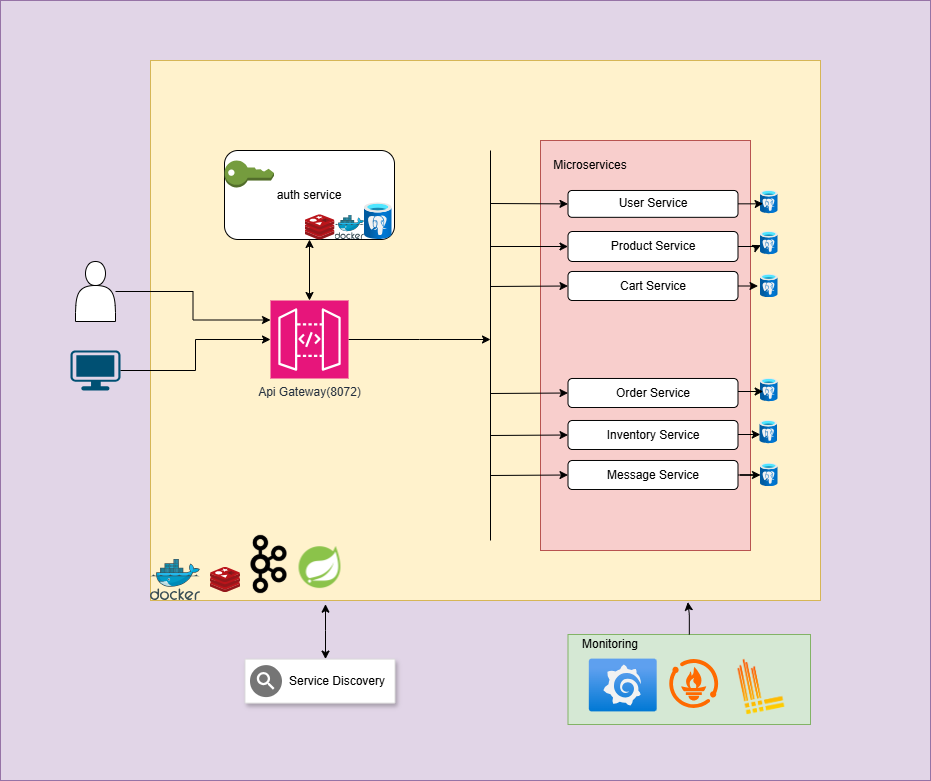

<div align="center">
  
</div>

# Kasyus E-Commerce Platform
A cloud-native, microservices-based e-commerce platform built with Spring Boot, Spring Cloud, and Docker.

## What is Kasyus?
Kasyus is named after **Kasyus (Kassius) Mountain**, also known as **Kel Dağı**, a dormant volcanic mountain in Hatay, Türkiye. The mountain has historical significance and is known for its rich biodiversity and ancient ruins, including the St. Barlaam Monastery from the Roman era.

## Overview and Service Documentation

This project implements a microservices-based e-commerce system with the following services:
For detailed setup and configuration of each service, please refer to their respective README files:

| Service Name           | Port   | Description                                      | Status           |
|------------------------|--------|--------------------------------------------------|------------------|
| [**API Gateway**](api-gateway/README.md)        | 8072   | Routes and secures client requests               | ✅ Running        |
| [**Discovery Service**](discovery-service/README.md)  | 8761   | Service registry using Eureka                    | ✅ Running        |
| [**Auth Service**](auth-service/README.md)       | 8084   | Handles authentication and token management      | ✅ Running        |
| [**User Service**](user-service/README.md)       | 8085   | Manages user profiles, addresses, and payments   | ✅ Running        |
| [**Product Service**](product-service/README.md) | 8081   | Product catalog, pricing, and image management   | ✅ Running        |
| [**Cart Service**](cart-service/README.md)       | 8087   | Manages user shopping carts                      | ✅ Running        |
| [**Order Service**](order-service/README.md)     | 8083   | Handles order creation and tracking              | 🚧 In Development |
| [**Message Service**](message/README.md)         | 8089   | Will be refactored into Notification Service     | 🔄 Refactoring    |
| **Inventory Service**  | TBD    | Stock tracking and warehouse sync                | 🔜 Planned        |
| **Payment Service**    | TBD    | Processes user payments                          | 🔜 Planned        |
| **Reviews & Ratings**  | TBD    | Customer feedback on products                    | 🔜 Planned        |
| **MinIO**              | 9001   | Object storage for media assets                  | ✅ Running        |
| **Kafka**              | N/A    | Event streaming platform                         | ✅ Running        |

### Legend:
- ✅ **Running** – Fully functional and deployed
- 🚧 **In Development** – Work in progress
- 🔄 **Refactoring** – Being restructured or renamed
- 🔜 **Planned** – Will be implemented soon

## Architecture


<p align="center">
  
</p>


## Technical Stack

### Core Technologies
- Java 21
- Spring Boot 3.4.1
- Spring Cloud
- Spring Security (Custom Auth Service)
- PostgreSQL
- Redis
- Apache Kafka
- MinIO (Object Storage)
- Docker & Docker Compose

### Infrastructure
- Service Discovery: Netflix Eureka
- API Gateway: Spring Cloud Gateway
- Authentication: Custom Auth Service
- Cache: Redis (Port: 6379)
- Database: PostgreSQL (Port: 5432)
- Storage: MinIO (Port: 9001)

## Getting Started

### Prerequisites

- Docker & Docker Compose
- Java 21 JDK (for local development)
- Maven (for local development)

### Quick Start

1. Clone the repository:
```bash
git clone https://github.com/mehmetgencv/kasyus.git
cd kasyus
```

2. Start all services using Docker Compose:
```bash
cd docker-compose/default
docker-compose up -d
```

## Frontend
Kasyus also includes a frontend built with React. You can find it here: [Kasyus Frontend](https://github.com/mehmetgencv/kasyus-fe)

To run the frontend locally:
```bash
git clone https://github.com/mehmetgencv/kasyus-fe.git
cd kasyus-fe
npm install
npm start
```

## Deployment Options

### Kubernetes Deployment

For production-grade deployment using Kubernetes, refer to our [Kubernetes Deployment Guide](kubernetes/README.md).

Key features of our Kubernetes deployment:
- Scalable microservices architecture
- Automated health checks and recovery
- Resource management and monitoring
- Persistent storage for databases and caches
- Service discovery and load balancing

To get started with Kubernetes deployment:
```bash
cd kubernetes
kubectl apply -f 1_configmaps.yaml
# Follow the deployment guide for complete instructions
```

### Service URLs

- API Gateway: http://localhost:8072
- Discovery Service Dashboard: http://localhost:8761
- MinIO Console: http://localhost:9001

## Authentication and API Usage

For detailed instructions on setting up authentication and using the APIs, please refer to our [Usage Guide](public/kasyus-usage.md). The guide covers:

- Creating service accounts and users
- Assigning roles and permissions
- Making authenticated API requests
- Error handling and troubleshooting

### Authentication Setup

Users can register via the Auth Service:

```json
{
  "firstName": "John",
  "lastName": "Doe",
  "email": "john.doe@example.com",
  "password": "securepassword",
  "role": "USER"
}
```

2. Use the token in your requests:
```bash
curl -X GET http://localhost:8072/api/v1/products \
  -H 'Authorization: Bearer YOUR_ACCESS_TOKEN'
```

## Database Configuration

The PostgreSQL instance is configured with:
- Username: kasyus
- Password: kasyus123
- [Databases](docker-compose/prod/init-scripts/init-multiple-dbs.sql): kasyus_products, kasyus_orders ...

## 🚀 Monitoring

<div align="center">
  
  
  
  
  
  
  
</div>

### 🔍 Observability Stack Overview
This project utilizes a comprehensive observability stack, integrating **Grafana, Prometheus, Loki, Tempo, Alloy, OpenTelemetry,** and **Micrometer.io** to monitor application performance, logs, and distributed traces.

Each service exposes **health, metrics, and system information** via **Spring Boot Actuator** endpoints:

- ✅ **Health Check** → [`/actuator/health`](#) – Shows service health status.
- ℹ️ **Application Info** → [`/actuator/info`](#) – Displays metadata about the service.
- 📊 **Metrics** → [`/actuator/metrics`](#) – Provides detailed application performance metrics.

📌 **For a detailed observability setup and usage guide, check the full documentation:**  
➡️ [**Detailed Monitoring Documentation**](docker-compose/observability/README.md)

## License

This project is licensed under the MIT License - see the [LICENSE](LICENSE) file for details.

