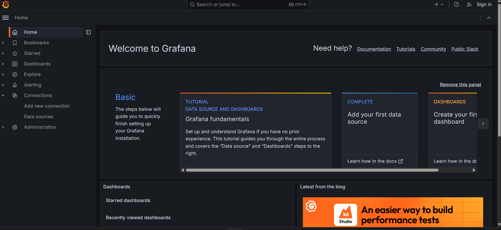

# Observability Stack

This project provides an observability stack using **Grafana**, **Prometheus**, **Loki**, **Alloy**, and **Tempo** to monitor and analyze system performance and logs.

## 📌 Components

### 1️⃣ Grafana  
- **Description**: Grafana is an open-source analytics and monitoring solution that allows you to visualize metrics, logs, and traces.
- **Access URL**: [http://localhost:3001](http://localhost:3001)
- **Default Login**:
    - Username: `admin`
    - Password: `admin` (Change after first login!)
- **Configuration**:
    - Data sources are defined in `observability/grafana/datasource.yml`
- **Example Dashboard**:
  

### 2️⃣ Prometheus 
- **Description**: Prometheus is a time-series database designed for collecting and querying metrics from applications and infrastructure.
- **Access URL**: [http://localhost:9090](http://localhost:9090)
- **Configuration File**: `observability/prometheus/prometheus.yml`
- **Example Query**: `up{job="my-service"}`
  
  

### 3️⃣ Loki 
- **Description**: Loki is a log aggregation system designed to work with Prometheus and Grafana.
- **Access URL**: [http://localhost:3100](http://localhost:3100)
- **Configuration File**: `observability/loki/loki-config.yaml`
- **Usage**: Logs can be queried via Grafana's Log Explorer.
- **Example Log Query**: `{app="my-service"}`
  
  

### 4️⃣ Tempo 
- **Description**: Tempo is a distributed tracing backend compatible with OpenTelemetry, Jaeger, and Zipkin.
- **Access URL**: Integrated via Grafana.
- **Configuration File**: `observability/tempo/tempo.yml`
- **Usage**: Allows tracing of requests across distributed systems.
- **Example Trace**: !
- 
- 

### 5️⃣ Alloy 
- **Description**: Alloy is an observability pipeline that collects, processes, and routes telemetry data (logs, metrics, traces).
- **Configuration File**: `observability/alloy/alloy-local-config.yaml`
- **Usage**: Works as a centralized telemetry processor.

## 🔍 Micrometer.io & OpenTelemetry

###   **Micrometer.io**
- **Purpose**: Micrometer provides a vendor-neutral facade for collecting application metrics.
- **Importance**: It allows applications to expose monitoring data in a format compatible with multiple observability platforms, including Prometheus.
- **Integration**: Micrometer is widely used in cloud-native environments to collect system metrics like request latency, memory usage, and active connections.

###  **OpenTelemetry**
- **Purpose**: OpenTelemetry is an open-source observability framework for collecting telemetry data, including metrics, logs, and traces.
- **Importance**: It enables **distributed tracing**, helping to track requests as they move through microservices.
- **Integration**: OpenTelemetry works with **Tempo** to collect and visualize request traces, providing insights into performance bottlenecks and failures.

## 🚀 Running the Observability Stack

To start all services, run:
```sh
cd docker-compose
docker-compose up -d
```

To stop the services:
```sh
docker-compose down
```

## 🔥 Troubleshooting
- Ensure all services are running by checking `docker ps`.
- View logs for a specific service:
  ```sh
  docker logs -f <container_id>
  ```
- Check Prometheus targets: [http://localhost:9090/targets](http://localhost:9090/targets)
- Verify Loki logs via Grafana Log Explorer.

## 📚 References
- [Grafana Documentation](https://grafana.com/docs/)
- [Prometheus Documentation](https://prometheus.io/docs/)
- [Loki Documentation](https://grafana.com/docs/loki/)
- [Tempo Documentation](https://grafana.com/docs/tempo/)
- [Micrometer.io Documentation](https://micrometer.io/)
- [OpenTelemetry Documentation](https://opentelemetry.io/)
